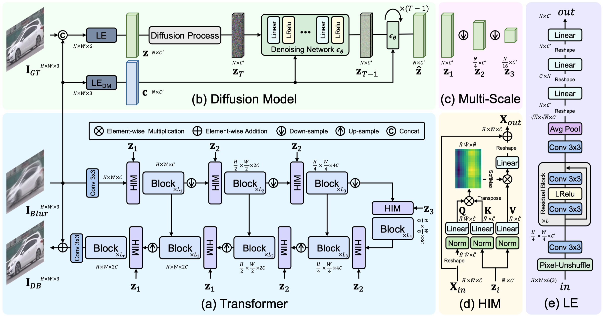

# Hierarchical Integration Diffusion Model for Realistic Image Deblurring

[Zheng Chen](https://zhengchen1999.github.io/), [Yulun Zhang](http://yulunzhang.com/), [Ding Liu](https://scholar.google.com/citations?user=PGtHUI0AAAAJ&hl=en), [Bin Xia](https://scholar.google.com/citations?user=rh2fID8AAAAJ), [Jinjin Gu](https://www.jasongt.com/), [Linghe Kong](https://www.cs.sjtu.edu.cn/~linghe.kong/), and [Xin Yuan](https://xygroup6.github.io/xygroup/), "Hierarchical Integration Diffusion Model for Realistic Image Deblurring", NeurIPS, 2023 (Spotlight)

[paper] [[arXiv](https://arxiv.org/pdf/2305.12966.pdf)] [[supplementary material](https://github.com/zhengchen1999/HI-Diff/releases)] [[visual results](https://drive.google.com/drive/folders/1ZG89h3kI-cUmNToal01f0wVrd6aKbnyp?usp=drive_link)] [[pretrained models](https://drive.google.com/drive/folders/1X3oos6dmtDDo9IqC6SK5RiujMYE6Y22q?usp=drive_link)]

#### 🔥🔥🔥 News

- **2023-10-10:** Code (Testing and Training) and pre-trained models are released 🎉🎉🎉
- **2023-05-22:** This repo is released.

---

> **Abstract:** *Diffusion models (DMs) have recently been introduced in image deblurring and exhibited promising performance, particularly in terms of details reconstruction. However, the diffusion model requires a large number of inference iterations to recover the clean image from pure Gaussian noise, which consumes massive computational resources. Moreover, the distribution synthesized by the diffusion model is often misaligned with the target results, leading to restrictions in distortion-based metrics. To address the above issues, we propose the Hierarchical Integration Diffusion Model (HI-Diff), for realistic image deblurring. Specifically, we perform the DM in a highly compacted latent space to generate the prior feature for the deblurring process. The deblurring process is implemented by a regression-based method to obtain better distortion accuracy. Meanwhile, the highly compact latent space ensures the efficiency of the DM. Furthermore, we design the hierarchical integration module to fuse the prior into the regression-based model from multiple scales, enabling better generalization in complex blurry scenarios. Comprehensive experiments on synthetic and real-world blur datasets demonstrate that our HI-Diff outperforms state-of-the-art methods.* 



---

|                              GT                              |                            Blurry                            |       [Restormer](https://github.com/swz30/Restormer)        | [Stripformer](https://github.com/pp00704831/Stripformer-ECCV-2022-) |                        HI-Diff (ours)                        |
| :----------------------------------------------------------: | :----------------------------------------------------------: | :----------------------------------------------------------: | :----------------------------------------------------------: | :----------------------------------------------------------: |
|  |  |  |  |  |
|            |          |     |   |       |

## Contents

1. [Installation](#Installation)
1. [Datasets](#Datasets)
1. [Models](#Models)
1. [Training](#Training)
1. [Testing](#Testing)
1. [Results](#Results)
1. [Citation](#Citation)
1. [Acknowledgements](Acknowledgements)

## Installation

- Python 3.9
- PyTorch 1.9.0
- NVIDIA GPU + [CUDA](https://developer.nvidia.com/cuda-downloads)

```bash
# Clone the github repo and go to the default directory 'HI-Diff'.
git clone https://github.com/zhengchen1999/HI-Diff.git
cd HI-Diff
conda create -n hi_diff python=3.9
conda activate hi_diff
pip install -r requirements.txt
```

## Datasets

| Dataset                            |           Description            |                             Link                             |
| ---------------------------------- | :------------------------------: | :----------------------------------------------------------: |
| GoPro                              |        Training + Testing        | [Google Drive](https://drive.google.com/file/d/1KYmgaQj0LWSCL6ygtXcuBZ6DfJgO09RQ/view?usp=drive_link) |
| RealBlur (RealBlur-R + RealBlur-J) |        Training + Testing        | [Google Drive](https://drive.google.com/file/d/1lSHA9AVzPzoUY3iGwgT299EzEUZUfKkM/view?usp=drive_link) |
| Test                               | Testing: GoPro + HIDE + RealBlur | [Google Drive](https://drive.google.com/file/d/1pUFsJQleqCGTeeHnsSukJU0oSbjjWIJP/view?usp=drive_link) |

Download training and testing datasets and put them into the corresponding folders of `datasets/`. See [datasets](datasets/README.md) for the detail of the directory structure.

## Models

| Model              | Training Dataset | PSNR (dB) | SSIM  |                          Model Zoo                           |                        Visual Results                        |
| ------------------ | :--------------: | :-------: | :---: | :----------------------------------------------------------: | :----------------------------------------------------------: |
| HI-Diff-GoPro      |      GoPro       |   33.33   | 0.964 | [Google Drive](https://drive.google.com/file/d/1cx0vCV5Z5fklnbqonZQad37vt4armEbT/view?usp=drive_link) | [Google Drive](https://drive.google.com/file/d/1cKDG_H4pJafd5RFO0jLlN_BHmBl6a7Ov/view?usp=drive_link) |
| HI-Diff-RealBlur-R |    RealBlur-R    |   41.01   | 0.978 | [Google Drive](https://drive.google.com/file/d/1inQwZ6SJIHYyZoQo702Mv4upjvgg3kFA/view?usp=drive_link) | [Google Drive](https://drive.google.com/file/d/1F0RXsVaqo08dr0QJBnuXYa7fHCwFe-Ek/view?usp=drive_link) |
| HI-Diff-RealBlur-J |    RealBlur-J    |   33.70   | 0.941 | [Google Drive](https://drive.google.com/file/d/1zdAOurzjAONRmLuPmSi0nppyqT2ORIRg/view?usp=drive_link) | [Google Drive](https://drive.google.com/file/d/1kuqgNuiX5rnsEFWUg1EKb7yhgWYI5ab_/view?usp=drive_link) |

The performance is reported on the corresponding testing datasets.

## Training

- Download [GoPro](https://drive.google.com/file/d/1TubDkirxl4qAWelfOnpwaSKoj3KLAIG4/view?usp=share_link) datasets, place them in `datasets/`.

- Generate image patches from GoPro dataset for training.

  ```python
  python generate_patches_gopro.py 
  ```

- Run the following scripts. The training configuration is in `options/train/`.

  ```shell
  # Synthetic, GoPro, 2 Stages, 4 GPUs
  python -m torch.distributed.launch --nproc_per_node=4 --master_port=4321 train.py -opt options/train/GoPro_S1.yml --launcher pytorch
  python -m torch.distributed.launch --nproc_per_node=4 --master_port=4321 train.py -opt options/train/GoPro_S2.yml --launcher pytorch
  
  # Real-World, RealBlur-R, 2 Stages, 4 GPUs
  python -m torch.distributed.launch --nproc_per_node=4 --master_port=4321 train.py -opt options/train/RealBlur_R_S1.yml --launcher pytorch
  python -m torch.distributed.launch --nproc_per_node=4 --master_port=4321 train.py -opt options/train/RealBlur_R_S2.yml --launcher pytorch
  
  # Real-World, RealBlur-J, 2 Stages, 4 GPUs
  python -m torch.distributed.launch --nproc_per_node=4 --master_port=4321 train.py -opt options/train/RealBlur_J_S1.yml --launcher pytorch
  python -m torch.distributed.launch --nproc_per_node=4 --master_port=4321 train.py -opt options/train/RealBlur_J_S2.yml --launcher pytorch
  ```

- The training experiment is in `experiments/`.

## Testing

- Download the pre-trained [models](https://drive.google.com/drive/folders/1iBdf_-LVZuz_PAbFtuxSKd_11RL1YKxM?usp=drive_link) and place them in `experiments/pretrained_models/`.

- Download [Test](https://drive.google.com/file/d/1yMbItvFKVaCT93yPWmlP3883XtJ-wSee/view?usp=sharing) (GoPro, HIDE, RealBlur) datasets, place them in `datasets/`.

- Run the following scripts. The testing configuration is in `options/test/`.

  Synthetic, reproduces results in Table 2 of the main paper

  ```python
  # generate images
  python test.py -opt options/test/GoPro.yml
  # test PSNR/SSIM
  evaluate_gopro_hide.m
  python evaluate_realblur.py --dataset RealBlur_R --dir results/test_HI_Diff_GoPro
  python evaluate_realblur.py --dataset RealBlur_J --dir results/test_HI_Diff_GoPro
  ```

  Real-World, RealBlur-R, reproduces results in Table 3 of the main paper

  ```python
  # generate images
  python test.py -opt options/test/RealBlur_R.yml
  # test PSNR/SSIM
  python evaluate_realblur.py --dataset RealBlur_R --dir results/test_HI_Diff_RealBlur_R
  ```

  Real-World, RealBlur-J, reproduces results in Table 3 of the main paper

  ```python
  # generate images
  python test.py -opt options/test/RealBlur_J.yml
  # test PSNR/SSIM
  python evaluate_realblur.py --dataset RealBlur_J --dir results/test_HI_Diff_RealBlur_J
  ```

- The output is in `results/`.

## Results

We achieved state-of-the-art performance on synthetic and real-world blur dataset. Detailed results can be found in the paper.

<details>
<summary>Evaluation on Synthetic Datasets (click to expan)</summary>

- quantitative comparisons in Table 2 of the main paper

<p align="center">
  
</p>

- visual comparison in Figure 4 of the main paper

<p align="center">
  
</p>
</details>

<details>
<summary>Evaluation on Real-World Datasets (click to expan)</summary>

- quantitative comparisons in Table 3 of the main paper

<p align="center">
  
</p>

- visual comparison in Figure 5 of the main paper

<p align="center">
  
</p>

</details>

## Citation

If you find the code helpful in your resarch or work, please cite the following paper(s).

```
@inproceedings{chen2023hierarchical,
  title={Hierarchical Integration Diffusion Model for Realistic Image Deblurring}, 
  author={Chen, Zheng and Zhang, Yulun and Ding, Liu and Bin, Xia and Gu, Jinjin and Kong, Linghe and Yuan, Xin},
  booktitle={NeurIPS},
  year={2023}
}
```

## Acknowledgements

This code is built on  [BasicSR](https://github.com/XPixelGroup/BasicSR), [Restormer](https://github.com/swz30/Restormer), and [DiffIR](https://github.com/Zj-BinXia/DiffIR).
